# Overview

The reason why I created this project:

The example project [VertexAnimSample - Box.com](https://epicgames.box.com/s/qlzveuyov93p9a00gjbiftim1yy207ew) that was provided by official document ([Baking out vertex animation in editor with AnimToTexture](https://dev.epicgames.com/community/learning/tutorials/daE9/unreal-engine-baking-out-vertex-animation-in-editor-with-animtotexture)) was obsolete, there're some serious issues haven't been addressed, but Epic doesn't update the example, the Editor Utility Wdiget in the origin project can't be run properly.

# Content

This's an UE5 project to demonstrate VAT: Bake bone (SkeletalMesh) animation into Vertex Animation Texture, and play animation using material (the main work is running in vertex shader) of StaticMesh.

# How to run

> [!IMPORTANT]  
> Make sure plugin `AnimToTexture` has been enabled in your project.

1. EUW_VAT_Utils is an Editor Utility Widget bake Vertex Animation Textures automatically, credit to [AnimToTextureHelpers](https://github.com/kromond/AnimToTextureHelpers).  
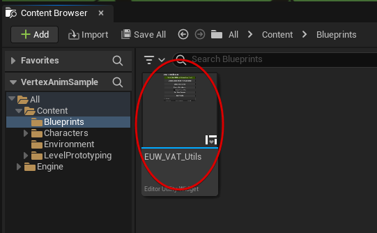
> [!WARNING]  
> The origin EUW_VAT_Utils only works in UE5.1, I fixed some issues to make it workable in UE5.3.

2. Create a replica from your origin assets, because the material will be interpolated by EUW_VAT_Utils automatically.  
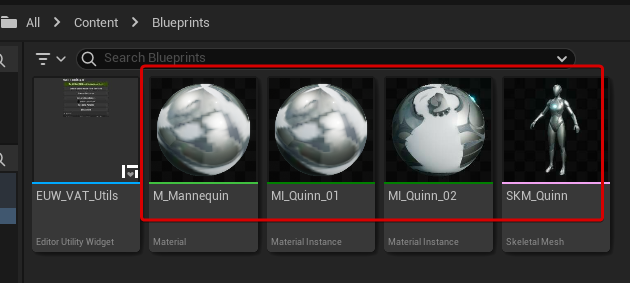

3. Then locate to the directory of plugin content: /AnimToTexture/Characters/Mannequin/Materials/BoneAnimation/  
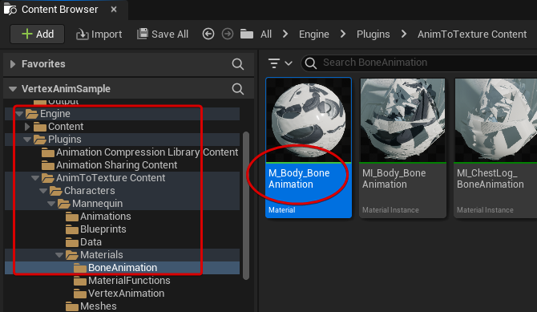

	Copy the these three nodes below.  
	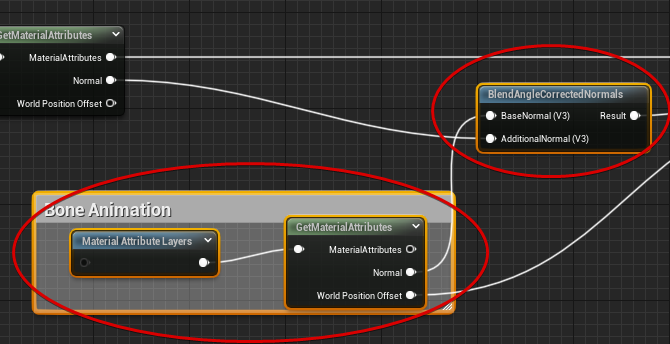

	Paste into your material:  
	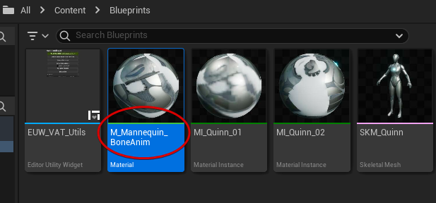

	Final result:  
	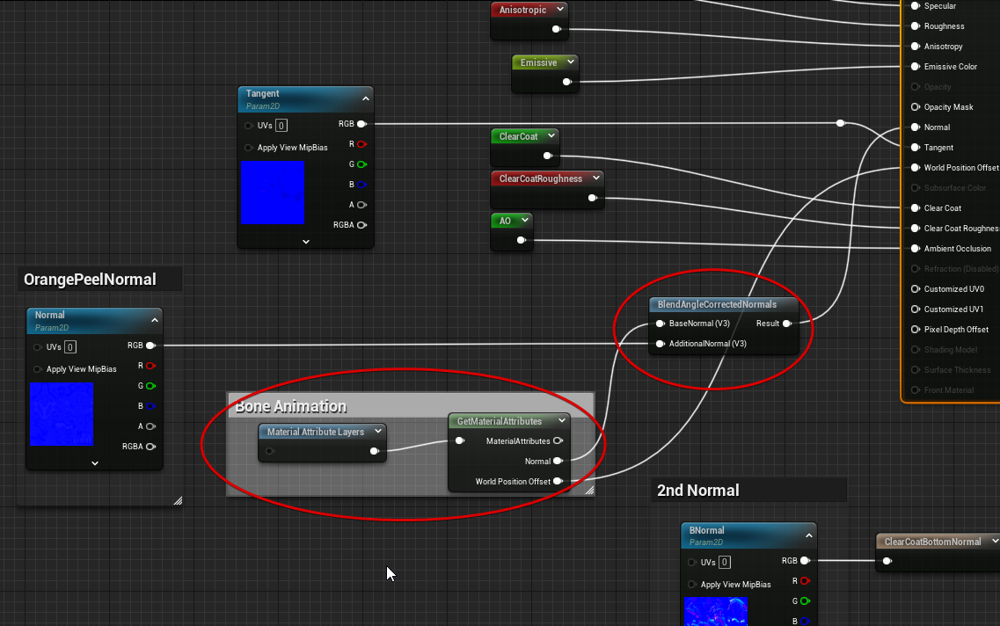

4. Change the material's reference of SkeletalMesh asset.  
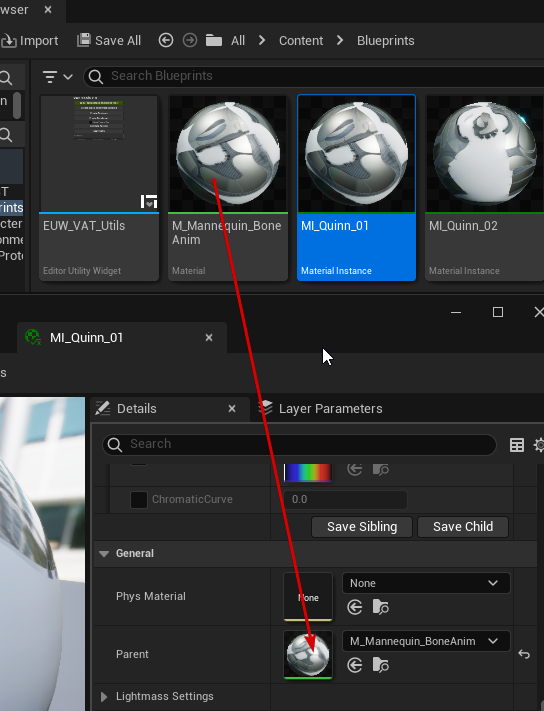  
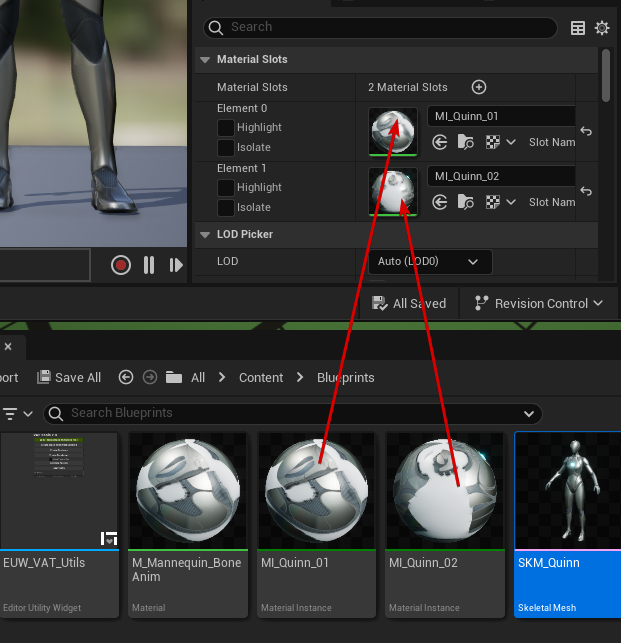

5. Right click EUW_VAT_Utils to run the widget.  
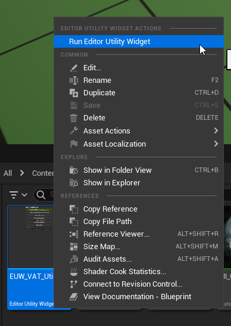

	Setup the parameters, and click Do All.  
	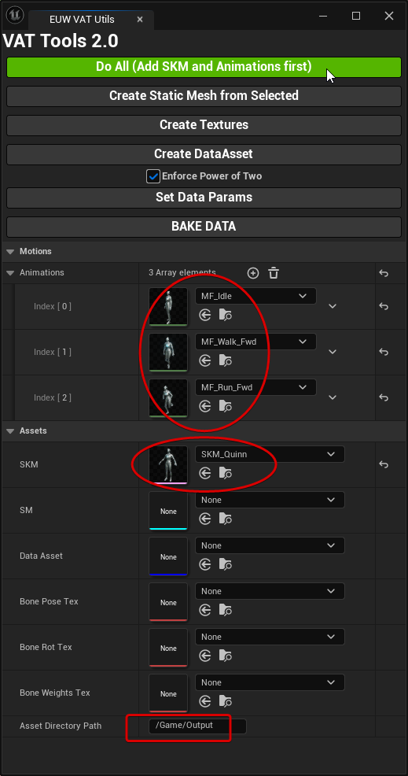

A moment later, Vertex Animation Textures have been generated.  
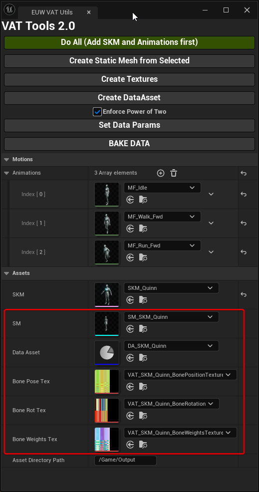  
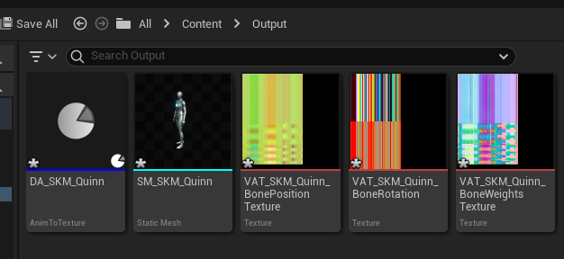

	And the materials has been tweaked automatically.  
	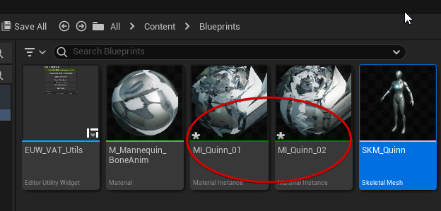  

	Final effect:  
	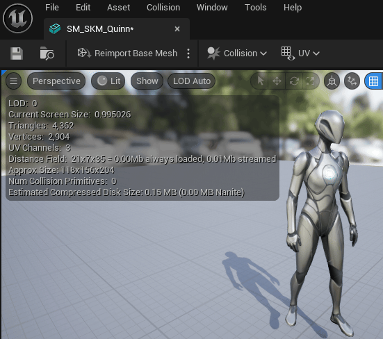

6. Because we baked multiple animation assets at once before, so we can switch animation by Material Parameter.  
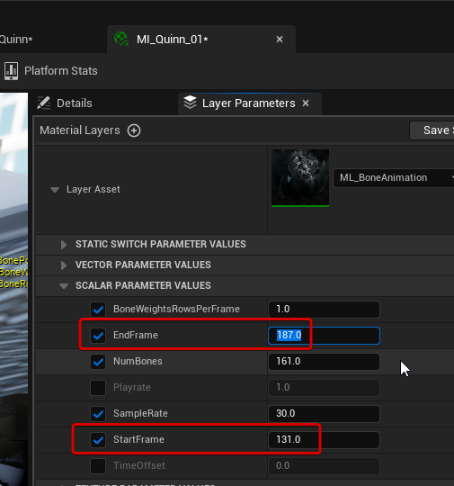  
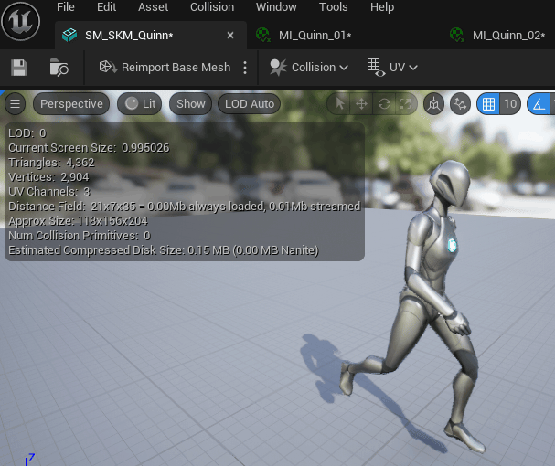

	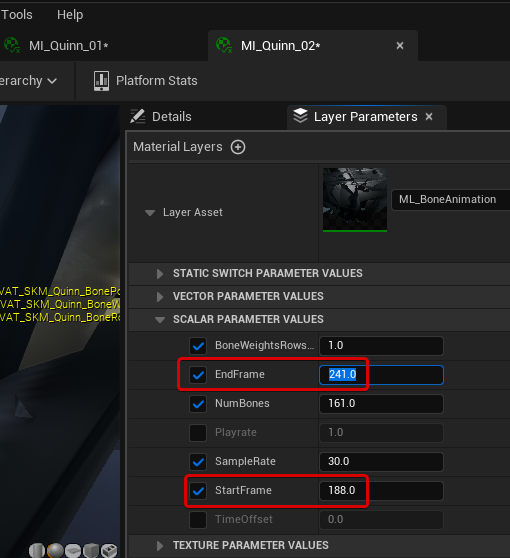  
	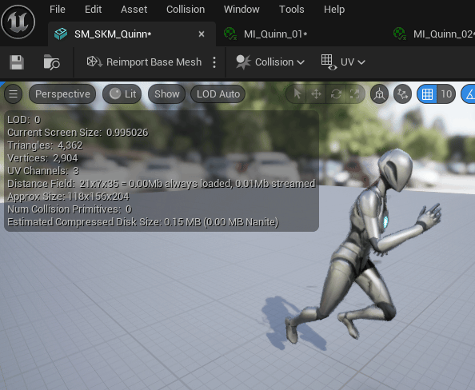

	How to get the animation frame length of an animation?  
	check the `Number of Sampled Keys` of AnimSequence.  
	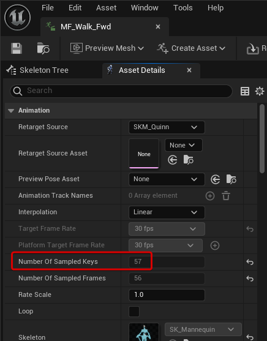

# References

AnimToTextureHelpers (EUW_VAT_Utils)  
